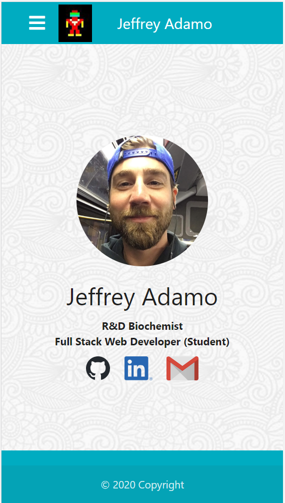
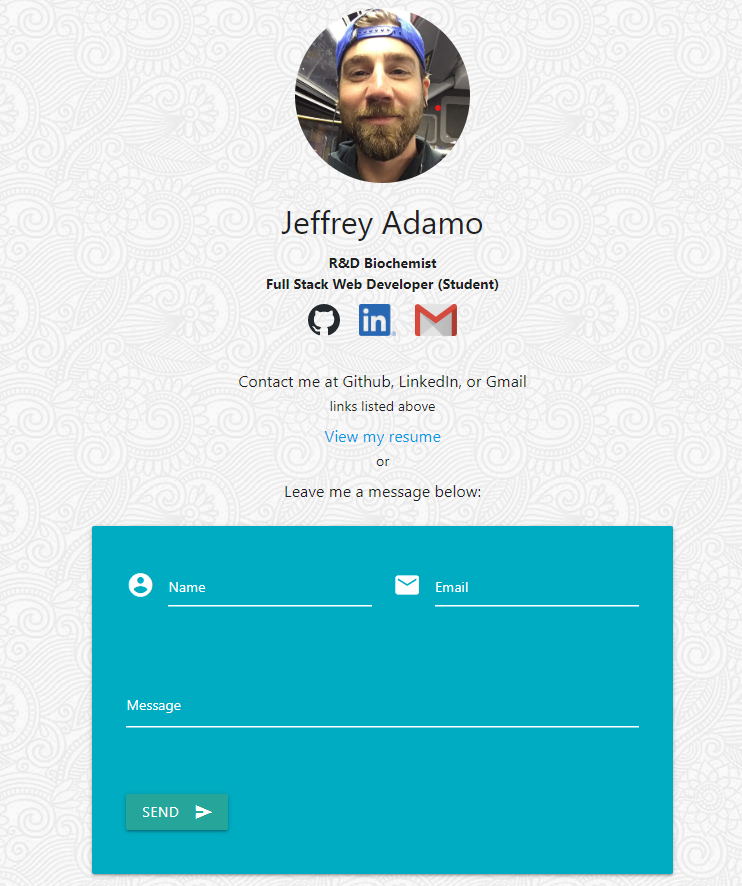

# Jeffrey's WebDev Portfolio *featuring React*

### Jeffrey Adamo  
UW Full Stack BootCamp  
Week 20 Homework: React Portfolio Update  
[Jeffrey Adamo's WebDev Portfolio](#)  
July 20, 2020

## Objective

Here's a showcase of my web development portfolio with projects and homework assignments completed while enrolled in **UW's Full Stack Web Developemnt boot camp**. This is the *third* iteration of portfolios during this course. This version features **ReactJS** design and was initiated in week 20. The previous version was in week 8 using Materialize CSS framework, JavaScript and JQuery. A simple portfolio was also created in week 2 where HTML and CSS were the only languages introduced. 

This portfolio features updates to the following:
* [Porfolio](#)
* [GitHub Profile](https://github.com/jeffreyadamo)
* [Resume](https://drive.google.com/file/d/1aIuHTJ-yNRtMZkgQxSn8pqImSvtq8YX_/view?usp=sharing)
* [LinkedIn Profile](https://www.linkedin.com/in/jeffadamo)

## Portfolio Features:

### Designed using [React](#)

Multiple CSS Frameworks utilized for portfolio items include:
* *This portfolio* uses [MaterializeCSS](https://materializecss.com/) framework
* Week 7 Group Project: Pandemic Pantry used [ZURB Foundation](https://get.foundation/sites/docs/)
* Weel 6: Weather Dashboard & Work Day Scheduler used [BootstrapCDN](https://getbootstrap.com/docs/4.4/getting-started/introduction/)

## Demo:

  
  
  
* Mobile-first design. Links collapse into a hamburger (as seen on Iphone6):  

### Portfolio.html

User is greeted with cards containing information on featured projects. Image of landing page is displayed with title and links to GitHub Pages and GitHub Repository. The cards can be clicked on to display more information on the back of the card. A demo button allows the user to see a .gif previewing the interaction of the website in a modal. 

### Contact.html

User is greeted with same landing as index.html, but with a few more details describing that the images are clickable links that direct toward GitHub Profile, LinkedIn Profile, and email using "mailto:jeffreyadamo@gmail.com". There is also an link to my resume hosted on Google Drive:

### Aboutme.html

User is greeted with some content about myself. Below is displayed on an iPad and shows the hamburger's usage and how by clicking on my name on the navbar, the user will be directed back to index.html.

## Issues/Future Development:

 I would like to see a message form in /contact for direct email commenting

