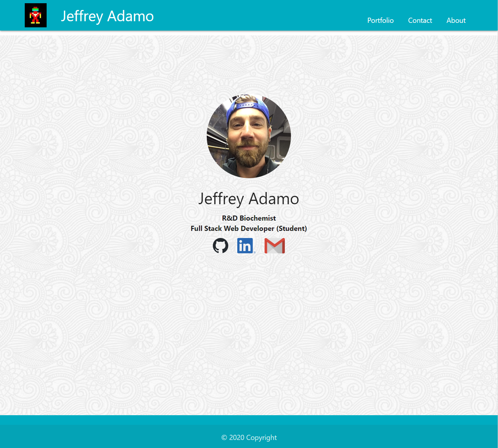
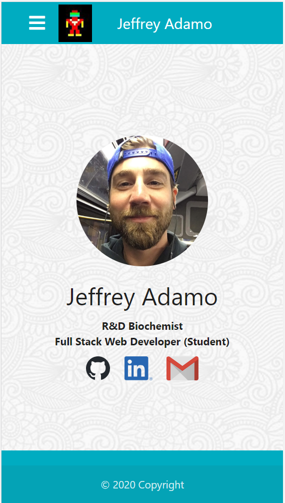
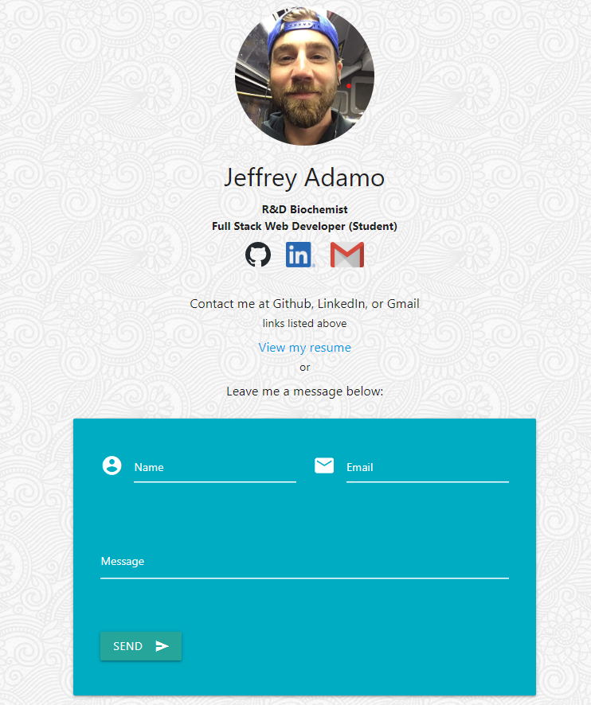

# Portfolio Update

### Jeffrey Adamo  
UW Full Stack BootCamp  
Week 8 Homework: Portfolio Update  
[Jeffrey Adamo's WebDev Portfolio](https://jeffreyadamo.github.io/Portfolio/)  
April 25, 2020

## Objective

Update of my web development portfolio with projects and homework assignments completed. A simple portfolio was created in week 2 while HTML and CSS were the only languages introduced. Since then, other concepts have been introduced that can now showcase JavaScript, DOM Manipulation, APIs (third-party and server-side) and group collaboration with Git and GitHub.

This assignment features updates to the following:
* [Porfolio](https://jeffreyadamo.github.io/Portfolio/)
* [GitHub Profile](https://github.com/jeffreyadamo)
* [Resume](https://drive.google.com/file/d/1aIuHTJ-yNRtMZkgQxSn8pqImSvtq8YX_/view?usp=sharing)
* [LinkedIn Profile](https://www.linkedin.com/in/jeffadamo)

## Portfolio Features:

Designed using [MaterializeCSS](https://materializecss.com/) framework
* This is the third CSS framework exhibited in this portfolio
* Week 7 Group Project: Pandemic Pantry used [ZURB Foundation](https://get.foundation/sites/docs/)
* Weel 6: Weather Dashboard & Work Day Scheduler used [BootstrapCDN](https://getbootstrap.com/docs/4.4/getting-started/introduction/)

JQuery: [Materialize via Cloudflare](https://cdnjs.cloudflare.com/ajax/libs/materialize/1.0.0/js/materialize.min.js)

Fonts: Materialize uses [Materialize via GoogleFonts](https://fonts.googleapis.com/icon?family=Material+Icons)

## Demo:
* User is greeted with simple index.html landing page with navbar containing links, a photo, and links to GitHub, LinkedIn, and Gmail. A footer and background images are present:  

  
  
  
  Website is responsive for a mobile design. Links collapse into a hamburger (as seen on Iphone6):  

### Portfolio.html

User is greeted with cards containing information on featured projects. Image of landing page is displayed with title and links to GitHub Pages and GitHub Repository. The cards can be clicked on to display more information on the back of the card. A demo button allows the user to see a .gif previewing the interaction of the website in a modal. 

### Contact.html

User is greeted with same landing as index.html, but with a few more details describing that the images are clickable links that direct toward GitHub Profile, LinkedIn Profile, and email using "mailto:jeffreyadamo@gmail.com". There is also an link to my resume hosted on Google Drive:

 

### Aboutme.html

User is greeted with some content about myself. Below is displayed on an iPad and shows the hamburger's usage and how by clicking on my name on the navbar, the user will be directed back to index.html.

 

## Issues/Future Development:

### I would like to see a message form in contact.html, but currently do not know how to hook it up. I've designed the front end to match the styling used, but do not yet know how to implement this. A seperate branch has been made named "contactMessage" that had the placeholder code for this design.

